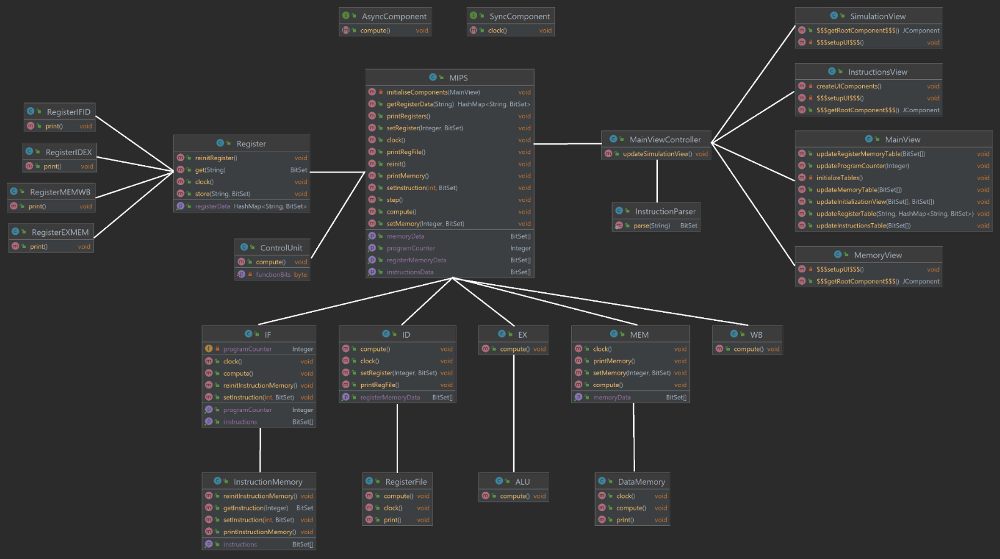

# MIPS-Simulator-in-Java
## Context
Scopul acestui proiect este simularea executiei instructiunilor intr-o unitate centrala de procesare de tip
pipeline. Intr-o arhitectura pipeline, etapele de executie a unei instructiuni sunt impartite pe mai multe
cicluri de ceas, motivul fiind dorinta de a micsora lungimea drumului critic iar prin urmare permitandu-
ne sa avem o frecventa de ceas mai mare. Pentru o intelegere mai buna a functionarii unei astfel de
arhitecturi, acest proiect isi propune sa simuleze executia unor instructiuni introduse de utilizator,
ilustrand la fiecare ciclu de ceas starea registrilor in fiecare etapa de procesare.

## Studiu bibliografic 
Varianta Pipeline a procesorului MIPS a aparut datorita dorintei de a miscora lungimea drumului critic
pentru a putea avea o frecventa de ceas mai mare. Astfel, instructiunile sunt impartite in mai multe
etape, etajele care sectioneaza caile de date transferand informatia cu ajutorul unor registri
intermediari.

Operatiile realizate de fiecare etaj:
1. Instruction Fetch
o Instructiunea pe 26 de biti de la adresa data de program counter este transferata din
memoria de instructiuni in registrul IF/ID.
o Program counterul este fie incrementat cu 4 fie suprascris de o instructiune de salt.
o Valoarea PC+4 este memorata in registrul IF/ID pentru a putea fi folosita ulterior
2. Instruction Decode & Register read
o Instructiunea din IF/ID este decodificata, in functie de tipul instructiunii unitatea de
control scriind in registrul ID/EX semnalele de control corespunzatoare
o Registrii $rs, $rt de la adresele citite din registrul IF/ID sunt cititi apoi scrisi in registrul
ID/EX
o Imediatul este extins cu semn daca ExtOp este activ, iar apoi scris in registrul ID/EX
o Daca semnalul RegWrite este activ atunci la adresa WriteRegister se va scrie WriteData
3. Execute operation
o Unitatea ALU proceseaza un rezultat, operatia find determinata de semnalul de control
ALUOp
o Semnalul ALUSrc determina sursa celui de al doilea operand ALU
o Se calculeaza (PC+4) << 2 pentru a putea fi utilizat ulterior
o Se scriu in registrul EX/MEM:
▪ Rezultatul ALU
▪ Semnalele de control Branch, MemWrite, PCSrc, Zero si MemToReg
▪ (PC + 4) << 2
▪ $rt sau $rd in functie de RegDst
4. Memory
o Memoria de date fie scrie fie citeste in functie de semnalul MemWrite
o Semnalul PCSrc este activat daca semnalul Branch si Zero sunt activate
o Se scriu in registrul MEM/WB:
▪ Valoarea citita din memorie
▪ Rezultatul ALU din EX/MEM
▪ Semnalele de control MemToReg si PCSrc
▪ WriteAddress din EX/MEM
5. WriteBack
o Selecteaza in functie de MemToReg valoarea lui WriteData din memoria RF, fie
rezultatul ALU fie valoarea extrasa din memoria de date.

## Design

### Register 
Un element esential in construirea acestei arhitecturi va fi clasa Register reprezentand un
registru pipeline. Intr-un registru pipeline valorile de la intrare vor fi scrise doar la semnalul de clock.
Acest lucru va fi simulat prin stocarea informatiilor in doua Liste: waitingValues si Values. In etapa de
pre-calculare etajele vor stoca valorile calculate in waitingValues, iar in etapa de clock elementele din
waitingValues vor fi transferate in values.
Astfel, toate etajele vor procesa informatia cu valori din registre scrise la clock-ul anterior (values),
evitand posibilitatea suprascrierii acestora inainte ca toate celelalte etaje sa fi procesat informatia din el.

### Design-ul componentelor hardware
Pentru reprezentarea componentelor hardware, clasele vor fi structurate ierarhic, clasa MIPS
continand toate etajele, iar fiecare etaj continand componentele sale specifice. 

Pentru a marca tipul de componenta, se vor defini doua interfete:
• AsyncComponent – clasa implementeaza functia compute() pentru calculul operatiilor asincrone
• SyncComponent – clasa implementeaza functia clock() pentru calculul operatiilor ce tin de
impulsul de ceas.
Stabilirea acestei ierarhii si marcarea claselor cu interfetele de mai sus ne va permite sa apelam din
parinte in fiu functiile clock() si compute(), in etapa operatiilor sincrone clasa MIPS apeland functia
clock() a tuturor etajelor, iar etajele apeland functia mai departe pentru toate componentele lor.

### Ghid de utilizare
Parserul de instructiuni se asteapta ca instructiunile sa fie intr-un anumit format pentru a le putea
interpreta corect.
1. Instructiunile se vor scrie cate una pe linii separate.
2. Formatul instructiunilor va fi urmatorul (acoladele nu trebuie scrise ci doar marcheaza
campurile):

  - ADD: add {rs} {rt} {rd}
  - SUB: sub {rs} {rt} {rd}
  - AND: and {rs} {rt} {rd}
  - OR: or {rs} {rt} {rd}
  - XOR: xor {rs} {rt} {rd}
  - SLL: sll {rs} {rd} {shiftAmount}
  - SRL: srl {rs} {rd} {shiftAmount}
  - SLT: slt {rs} {rt} {rd}
  - LW: lw {rs} {rt} {immediate}
  - SW: sw {rs} {rt} {immediate}
  - ADDI: addi {rs} {rt} {immediate}
  - J: j {jumpAddress}
  - BEQ: beq {rs} {rt} {branchOffset}

3. rs, rt, rd, shiftAmount, jumpAddress sunt numere pozitive intregi iar immediate si branchOffset
sunt intregi cu semn (se va pune simbolul „-„ in fata numarului in cazul numerelor negative)

#### Exemplu de program:

0. lw 0 1 0
1. lw 0 2 1
2. add 0 0 0
3. add 0 0 0
4. add 0 0 0
5. beq 1 2 12
6. add 0 0 0
7. add 0 0 0
8. add 0 0 0
9. add 0 0 0
10. addi 4 4 5
11. add 0 0 0
12. add 0 0 0
13. addi 1 1 1
14. add 0 0 0
15. add 0 0 0
16. j 5
17. add 0 0 0
18. add 0 0 0

O bucla repetitiva care aduna repetat valoarea 5 in registrul 4 de cate ori se specifica la adresa de
memorie 1

## Pentru detalii de implementare consultati documentatia Documentation.pdf
